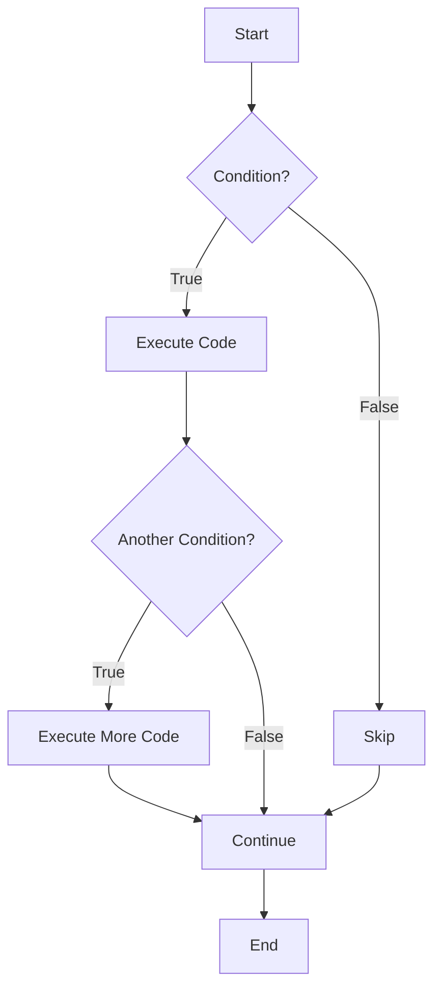
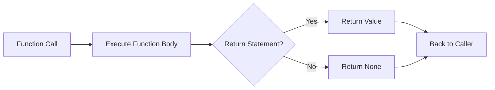
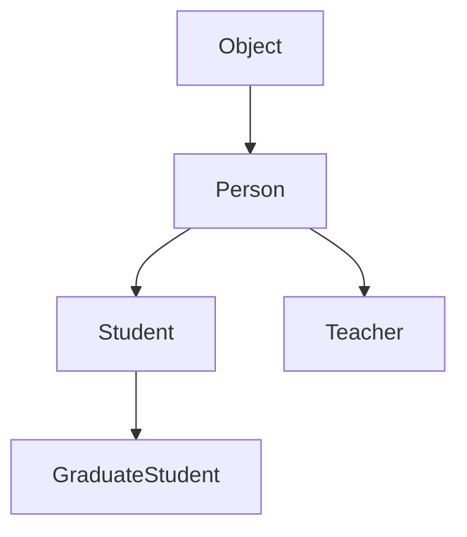
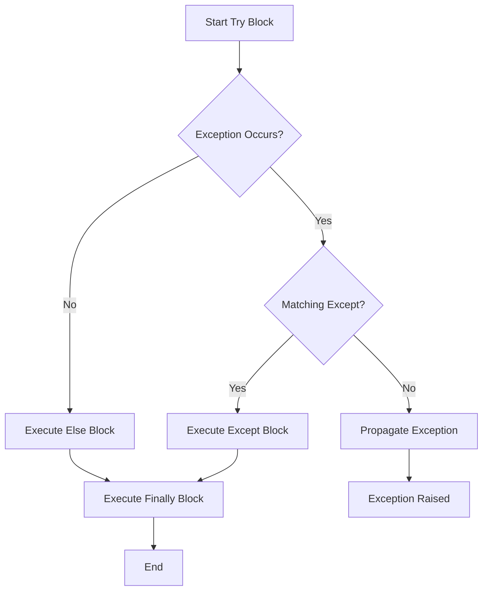
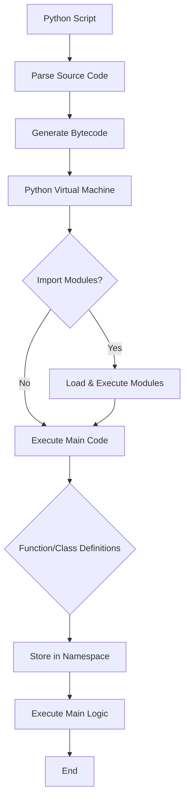

# Python Cheat Sheet

## Table of Contents
- [Basic Syntax](#basic-syntax)
- [Data Types](#data-types)
- [Control Flow](#control-flow)
- [Data Structures](#data-structures)
- [Functions](#functions)
- [Object-Oriented Programming](#object-oriented-programming)
- [File I/O](#file-io)
- [Exception Handling](#exception-handling)
- [Comprehensions](#comprehensions)
- [Common Built-in Functions](#common-built-in-functions)
- [String Operations](#string-operations)
- [Useful Modules](#useful-modules)

---

## Basic Syntax

### Variables
```python
x = 5                    # Integer
y = 3.14                 # Float
name = "Python"          # String
is_active = True         # Boolean
nothing = None           # NoneType
```

### Multiple Assignment
```python
a, b, c = 1, 2, 3
x = y = z = 0
```

### Type Conversion
```python
int("10")        # 10
float("3.14")    # 3.14
str(100)         # "100"
bool(1)          # True
list("abc")      # ['a', 'b', 'c']
```

---

## Data Types

### Numeric Types
```python
# Integer
x = 10
# Float
y = 3.14
# Complex
z = 2 + 3j
```

### Infinity
```python
# Positive infinity
inf = float('inf')
# Negative infinity
neg_inf = float('-inf')

# Usage examples
max_val = float('inf')    # Initialize to infinity for finding minimum
min_val = float('-inf')   # Initialize to negative infinity for finding maximum

# Comparisons
float('inf') > 1000000    # True
float('-inf') < -1000000  # True

# Math operations
float('inf') + 1          # inf
float('inf') * 2          # inf
float('inf') - float('inf')  # nan (not a number)

# Check for infinity
import math
math.isinf(float('inf'))  # True
math.isfinite(10)         # True
```

### Boolean
```python
True, False
bool(0)          # False
bool(1)          # True
bool("")         # False
bool("text")     # True
```

---

## Control Flow

### If-Elif-Else
```python
if x > 0:
    print("Positive")
elif x < 0:
    print("Negative")
else:
    print("Zero")

# Ternary operator
result = "Even" if x % 2 == 0 else "Odd"
```

### Loops

#### For Loop
```python
for i in range(5):           # 0 to 4
    print(i)

for i in range(2, 10, 2):    # 2, 4, 6, 8
    print(i)

for item in [1, 2, 3]:
    print(item)

for key, value in dict.items():
    print(key, value)
```

#### While Loop
```python
i = 0
while i < 5:
    print(i)
    i += 1
```

#### Loop Control
```python
break       # Exit loop
continue    # Skip to next iteration
pass        # Do nothing (placeholder)
```

### Control Flow Diagram


---

## Data Structures

### Lists (Mutable)
```python
# Creation
lst = [1, 2, 3, 4, 5]
empty = []

# Access
lst[0]           # 1 (first element)
lst[-1]          # 5 (last element)
lst[1:3]         # [2, 3] (slicing)

# Methods
lst.append(6)            # Add to end
lst.insert(0, 0)         # Insert at index
lst.remove(3)            # Remove first occurrence
lst.pop()                # Remove and return last
lst.pop(0)               # Remove at index
lst.extend([7, 8])       # Add multiple items
lst.reverse()            # Reverse in place
lst.sort()               # Sort in place
lst.clear()              # Remove all items

# Operations
len(lst)                 # Length
3 in lst                 # Membership test
lst + [6, 7]             # Concatenation
lst * 2                  # Repetition
```

### Tuples (Immutable)
```python
tup = (1, 2, 3)
single = (1,)            # Single element tuple
a, b, c = tup            # Unpacking

# Methods
tup.count(2)             # Count occurrences
tup.index(3)             # Find index
```

### Dictionaries (Key-Value Pairs)
```python
# Creation
d = {"name": "Python", "version": 3.9}
d = dict(name="Python", version=3.9)

# Access
d["name"]                # "Python"
d.get("name")            # "Python"
d.get("age", 0)          # 0 (default if not found)

# Methods
d.keys()                 # dict_keys(['name', 'version'])
d.values()               # dict_values(['Python', 3.9])
d.items()                # dict_items([('name', 'Python'), ...])
d.update({"age": 30})    # Add/update key-value pairs
d.pop("name")            # Remove and return value
d.clear()                # Remove all items

# Operations
"name" in d              # True
len(d)                   # 2
```

### Sets (Unique Elements)
```python
# Creation
s = {1, 2, 3}
s = set([1, 2, 2, 3])    # {1, 2, 3}

# Methods
s.add(4)                 # Add element
s.remove(2)              # Remove (raises error if not found)
s.discard(2)             # Remove (no error)
s.pop()                  # Remove arbitrary element
s.clear()                # Remove all

# Set Operations
a = {1, 2, 3}
b = {3, 4, 5}
a | b                    # Union: {1, 2, 3, 4, 5}
a & b                    # Intersection: {3}
a - b                    # Difference: {1, 2}
a ^ b                    # Symmetric difference: {1, 2, 4, 5}
```

---

## Functions

### Basic Function
```python
def greet(name):
    return f"Hello, {name}!"

# Call
greet("Python")
```

### Default Parameters
```python
def power(base, exponent=2):
    return base ** exponent

power(3)         # 9
power(3, 3)      # 27
```

### Variable Arguments
```python
# *args - positional arguments
def sum_all(*args):
    return sum(args)

sum_all(1, 2, 3, 4)      # 10

# **kwargs - keyword arguments
def print_info(**kwargs):
    for key, value in kwargs.items():
        print(f"{key}: {value}")

print_info(name="Python", version=3.9)
```

### Lambda Functions
```python
square = lambda x: x ** 2
add = lambda x, y: x + y

# Common use with map, filter, sorted
list(map(lambda x: x * 2, [1, 2, 3]))        # [2, 4, 6]
list(filter(lambda x: x > 2, [1, 2, 3, 4]))  # [3, 4]
sorted([3, 1, 2], key=lambda x: -x)          # [3, 2, 1]
```

### Decorators
```python
def decorator(func):
    def wrapper(*args, **kwargs):
        print("Before function")
        result = func(*args, **kwargs)
        print("After function")
        return result
    return wrapper

@decorator
def say_hello():
    print("Hello!")
```

### Function Execution Flow


---

## Object-Oriented Programming

### Classes
```python
class Person:
    # Class variable
    species = "Human"

    def __init__(self, name, age):
        # Instance variables
        self.name = name
        self.age = age

    def greet(self):
        return f"Hi, I'm {self.name}"

    @classmethod
    def from_birth_year(cls, name, birth_year):
        return cls(name, 2026 - birth_year)

    @staticmethod
    def is_adult(age):
        return age >= 18

# Create instance
p = Person("Alice", 30)
p.greet()

# Class method
p2 = Person.from_birth_year("Bob", 1990)

# Static method
Person.is_adult(20)
```

### Inheritance
```python
class Student(Person):
    def __init__(self, name, age, student_id):
        super().__init__(name, age)
        self.student_id = student_id

    def greet(self):
        return f"Hi, I'm {self.name}, student #{self.student_id}"
```

### Magic Methods
```python
class Point:
    def __init__(self, x, y):
        self.x = x
        self.y = y

    def __str__(self):
        return f"Point({self.x}, {self.y})"

    def __repr__(self):
        return f"Point({self.x}, {self.y})"

    def __add__(self, other):
        return Point(self.x + other.x, self.y + other.y)

    def __eq__(self, other):
        return self.x == other.x and self.y == other.y
```

### OOP Hierarchy


---

## File I/O

### Reading Files
```python
# Read entire file
with open('file.txt', 'r') as f:
    content = f.read()

# Read lines
with open('file.txt', 'r') as f:
    lines = f.readlines()

# Read line by line
with open('file.txt', 'r') as f:
    for line in f:
        print(line.strip())
```

### Writing Files
```python
# Write (overwrite)
with open('file.txt', 'w') as f:
    f.write("Hello\n")

# Append
with open('file.txt', 'a') as f:
    f.write("World\n")

# Write multiple lines
with open('file.txt', 'w') as f:
    f.writelines(['Line 1\n', 'Line 2\n'])
```

### File Modes
```python
'r'   # Read (default)
'w'   # Write (overwrite)
'a'   # Append
'r+'  # Read and write
'b'   # Binary mode (e.g., 'rb', 'wb')
```

---

## Exception Handling

### Try-Except
```python
try:
    result = 10 / 0
except ZeroDivisionError:
    print("Cannot divide by zero")
except Exception as e:
    print(f"Error: {e}")
else:
    print("No exception occurred")
finally:
    print("Always executed")
```

### Raising Exceptions
```python
def validate_age(age):
    if age < 0:
        raise ValueError("Age cannot be negative")
    return age
```

### Custom Exceptions
```python
class CustomError(Exception):
    def __init__(self, message):
        self.message = message
        super().__init__(self.message)

raise CustomError("Something went wrong")
```

### Exception Handling Flow


---

## Comprehensions

### List Comprehension
```python
# Basic
squares = [x**2 for x in range(10)]

# With condition
evens = [x for x in range(10) if x % 2 == 0]

# Nested
matrix = [[i*j for j in range(3)] for i in range(3)]

# Multiple conditions
[x for x in range(20) if x % 2 == 0 if x % 3 == 0]
```

### Dictionary Comprehension
```python
# Basic
squares = {x: x**2 for x in range(5)}

# With condition
{k: v for k, v in dict.items() if v > 10}

# Swap keys and values
{v: k for k, v in dict.items()}
```

### Set Comprehension
```python
unique_squares = {x**2 for x in [1, 2, 2, 3, 3, 4]}
```

### Generator Expression
```python
# Memory efficient (doesn't create list)
gen = (x**2 for x in range(1000000))
next(gen)        # Get next value
```

---

## Common Built-in Functions

### Type and Conversion
```python
type(x)          # Get type
isinstance(x, int)  # Check type
id(x)            # Object identity
```

### Math
```python
abs(-5)          # 5
max(1, 2, 3)     # 3
min(1, 2, 3)     # 1
sum([1, 2, 3])   # 6
pow(2, 3)        # 8
round(3.14159, 2)  # 3.14
```

### Iterables
```python
len([1, 2, 3])           # 3
sorted([3, 1, 2])        # [1, 2, 3]
reversed([1, 2, 3])      # iterator
enumerate(['a', 'b'])    # [(0, 'a'), (1, 'b')]
zip([1, 2], ['a', 'b'])  # [(1, 'a'), (2, 'b')]
all([True, True, False]) # False
any([True, False, False]) # True
```

### Functional
```python
map(lambda x: x*2, [1, 2, 3])     # [2, 4, 6]
filter(lambda x: x>1, [1, 2, 3])  # [2, 3]
```

### I/O
```python
print("Hello", end=' ')   # Print without newline
input("Enter name: ")     # Get user input
```

---

## String Operations

### String Methods
```python
s = "  Hello, World!  "

# Case
s.lower()               # "  hello, world!  "
s.upper()               # "  HELLO, WORLD!  "
s.capitalize()          # "  hello, world!  "
s.title()               # "  Hello, World!  "

# Whitespace
s.strip()               # "Hello, World!"
s.lstrip()              # "Hello, World!  "
s.rstrip()              # "  Hello, World!"

# Search
s.find("World")         # 9 (index, -1 if not found)
s.index("World")        # 9 (raises error if not found)
s.count("l")            # 3
s.startswith("  He")    # True
s.endswith("!  ")       # True

# Replace
s.replace("World", "Python")  # "  Hello, Python!  "

# Split/Join
"a,b,c".split(",")      # ['a', 'b', 'c']
",".join(['a', 'b'])    # "a,b"

# Check
"123".isdigit()         # True
"abc".isalpha()         # True
"abc123".isalnum()      # True
```

### String Formatting
```python
name = "Python"
version = 3.9

# f-strings (recommended)
f"Language: {name}, Version: {version}"

# format()
"Language: {}, Version: {}".format(name, version)
"Language: {n}, Version: {v}".format(n=name, v=version)

# % formatting (old style)
"Language: %s, Version: %.1f" % (name, version)
```

### String Slicing
```python
s = "Python"
s[0]        # 'P'
s[-1]       # 'n'
s[0:3]      # 'Pyt'
s[::2]      # 'Pto' (every 2nd char)
s[::-1]     # 'nohtyP' (reverse)
```

---

## Useful Modules

### Collections
```python
from collections import Counter, defaultdict, deque

# Counter
Counter([1, 1, 2, 3, 3, 3])  # Counter({3: 3, 1: 2, 2: 1})

# defaultdict
d = defaultdict(int)
d['key'] += 1  # No KeyError

# deque (double-ended queue)
dq = deque([1, 2, 3])
dq.appendleft(0)
dq.pop()
```

### Itertools
```python
from itertools import combinations, permutations, product, chain

list(combinations([1, 2, 3], 2))     # [(1,2), (1,3), (2,3)]
list(permutations([1, 2, 3], 2))     # [(1,2), (1,3), (2,1), ...]
list(product([1, 2], ['a', 'b']))    # [(1,'a'), (1,'b'), (2,'a'), (2,'b')]
list(chain([1, 2], [3, 4]))          # [1, 2, 3, 4]
```

### Math
```python
import math

math.sqrt(16)       # 4.0
math.ceil(3.2)      # 4
math.floor(3.8)     # 3
math.pi             # 3.141592653589793
math.e              # 2.718281828459045
```

### Random
```python
import random

random.randint(1, 10)           # Random int between 1-10
random.choice([1, 2, 3])        # Random element
random.shuffle([1, 2, 3])       # Shuffle in place
random.sample([1, 2, 3, 4], 2)  # Random sample of 2
random.random()                 # Random float [0, 1)
```

### Datetime
```python
from datetime import datetime, timedelta

now = datetime.now()
today = datetime.today()
date = datetime(2026, 2, 7)

# Formatting
now.strftime("%Y-%m-%d %H:%M:%S")

# Parsing
datetime.strptime("2026-02-07", "%Y-%m-%d")

# Arithmetic
tomorrow = now + timedelta(days=1)
```

### JSON
```python
import json

# Serialize
json.dumps({'key': 'value'})
with open('data.json', 'w') as f:
    json.dump({'key': 'value'}, f)

# Deserialize
json.loads('{"key": "value"}')
with open('data.json', 'r') as f:
    data = json.load(f)
```

### OS and Path
```python
import os
from pathlib import Path

# OS
os.getcwd()                # Current directory
os.listdir('.')            # List files
os.path.exists('file.txt') # Check if exists
os.path.join('a', 'b')     # Join paths

# Path (modern, recommended)
p = Path('file.txt')
p.exists()
p.is_file()
p.read_text()
p.write_text('content')
```

### Regular Expressions
```python
import re

# Match
re.match(r'\d+', '123abc')     # Match at start
re.search(r'\d+', 'abc123')    # Search anywhere
re.findall(r'\d+', 'a1b2c3')   # ['1', '2', '3']

# Replace
re.sub(r'\d+', 'X', 'a1b2')    # 'aXbX'

# Split
re.split(r'\s+', 'a  b   c')   # ['a', 'b', 'c']
```

---

## Python Execution Flow



---

## Best Practices

1. **Use meaningful variable names** - `user_count` not `uc`
2. **Follow PEP 8** - Python style guide
3. **Use list comprehensions** - More Pythonic and faster
4. **Use `with` for file operations** - Ensures proper cleanup
5. **Use `in` for membership tests** - `if x in [1, 2, 3]`
6. **Use `.get()` for dictionaries** - Avoid KeyError
7. **Use f-strings for formatting** - More readable
8. **Avoid mutable default arguments** - Use `None` instead
9. **Use `enumerate()` instead of `range(len())`**
10. **Use `is` for `None` comparisons** - `if x is None`

---

## Common Patterns

### Swapping Variables
```python
a, b = b, a
```

### Checking Multiple Conditions
```python
if x in [1, 2, 3]:  # Instead of: if x == 1 or x == 2 or x == 3
    pass
```

### Dictionary Get with Default
```python
value = d.get('key', default_value)
```

### Merging Dictionaries
```python
{**dict1, **dict2}  # Python 3.5+
dict1 | dict2        # Python 3.9+
```

### Flatten List
```python
flat = [item for sublist in nested for item in sublist]
```

### Remove Duplicates (Preserve Order)
```python
list(dict.fromkeys(lst))
```

---

*Happy Coding! 🐍*
